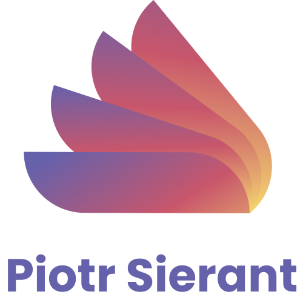

<div align="center">
  <a href="https://github.com/othneildrew/Best-README-Template">
    
  </a>

<h3 align="center">PortfolioWeb</h3>

  <p align="center">
    <a href="https://piotrsierant.github.io/portfolioWeb/">View Live</a>
  </p>
</div>

<!-- ABOUT THE PROJECT -->
## About The Project

The project was created for educational purposes as well as presenting my skills. The site contains information about my projects, CV, about me, contact information, etc.


### Built With

     

### Installation

_Below is an example of how you can  installing app._

1. Clone the repo
   ```sh
   git clone https://github.com/PiotrSierant/portfolioWeb.git
   ```
2. Install NPM packages
   ```sh
   npm install
   ```
3. Start project
   ```sh
   npm start
   ```

